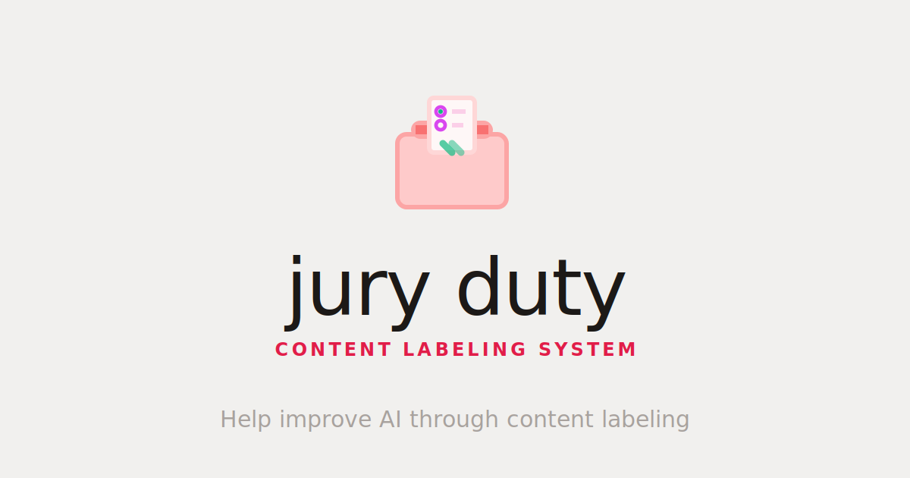

<p align="left">
  
</p>

## Jury Duty

Jury Duty is a data labeling engine for coordinated multi-rater annotation.

Each deployment is built around a single dataset: you host your own instance, load the data into Postgres, invite contributors, and collect labels in a structured format ready for IRR and downstream analysis.

It is designed for teams running their own annotation workflow, not a shared upload-anything platform.

## What It Does

- Assigns unlabeled items to contributors without collisions
- Stores every label in Postgres with the metadata needed for analysis
- Supports multiple raters on the same dataset
- Makes the resulting data usable for IRR, agreement checks, bias analysis, and custom research workflows

## Tech Stack

[](https://kit.svelte.dev/)
[](https://www.typescriptlang.org/)
[](https://tailwindcss.com/)
[](https://supabase.com/)
[](https://www.postgresql.org/)
[](https://deno.com/)

## Quick Start

### 1. Start Supabase

```bash
cd backend
npx supabase start
npx supabase db push
npx supabase functions deploy
```

### 2. Run the frontend

```bash
cd frontend
npm install
```

Create `frontend/.env.local` with:

```bash
PUBLIC_SUPABASE_URL=your_supabase_url
PUBLIC_SUPABASE_ANON_KEY=your_supabase_anon_key
```

Then start the app:

```bash
npm run dev
```

## Project Docs

- Backend: [backend/README.md](./backend/README.md)
- Frontend: [frontend/README.md](./frontend/README.md)
- API: [API_DOCUMENTATION.md](./API_DOCUMENTATION.md)

## Contributors

- Md Hishaam Akhtar
- Pranav Raghav
